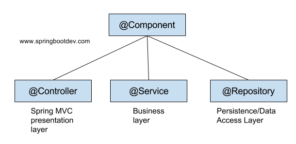

## Spring Framework 의 3가지 프로그래밍 모델
- DI / IOC
- AOP
- 서비스 추상화

## 강한 결합과 느슨한 결합
- ___결합도___ 란?  
A 객체가 B 객체를 멤버로 가질 때 A 객체는 B 객체에게 __의존한다__ 라고 표현한다. 결합도는 이처럼 서로 다른 두 시스템 간의 의존도를 의미한다. A 객체가 B 객체를 구현 클래스 타입으로 가지고 있을 경우 결합도가 높은 __강한 결합__ 이고, 인터페이스 타입으로 가지고 있을 경우 결합도가 낮은 __느슨한 결합__ 이다.  

## 의존성 주입(Dependency Injection)
- ___의존성 주입___ 이란?  
외부에서 __두 객체간의 관계를 결정해주는 디자인 패턴__ 으로, 인터페이스를 사이에 둬서 클래스 레벨에서는 의존 관계가 고정되지 않도록 하고 런타임 시 관계를 다이나믹하게 주입하여 __유연성을 확보하고 의존도를 낮출 수 있도록 해주는__ 프로그래밍 모델이다.  

- 의존성 주입을 왜 사용하는가?
	- 인터페이스를 활용하여 두 객체 사이의 의존도를 낮춰서 느슨한 결합을 가능하게 함
	- 두 객체 사이의 의존도를 어플리케이션 실행 시점에 유연하게 결정할 수 있음  

- 스프링에서는 다음과 같이 3가지 DI 를 활용할 수 있다.
	- Constructor-based Dependency Injection
	- Setter-based Dependency Injection
	- Field Injection  

- 각 방식의 차이점은 무엇이며 어떤 방식을 권장하는 가?  
결과적으로 스프링에서는 __생성자 주입(Constructor-based Dependency Injection)__ 을 권장한다. 생성자 주입 방식은 아래와 같이 3가지의 이점을 가진다.
	- 주입이 필요한 객체가 주입되지 않으면 객체를 생성할 수 없음. 즉 NullPointerException 을 방지함
	- 주입 받을 필드를 final 로 선언하여 주입 객체를 바꿔치기 하지 못하도록 방지할 수 있음
	- 순환 참조 상황에서 어플리케이션 자체가 구동되지 않음  

## 제어의 역전(Inversion of Control)
- ___제어의 역전___ 이란?  
객체를 생성하고 객체 간의 관계를 설정하는 것에 대한 제어권이 개발자가 아닌 외부의 컨테이너에게 넘어간 것을 의미한다. 스프링에서는 __BeanFactory 인터페이스__ 를 구현하는 __ApplicationContext 구현체__ 가 외부 컨테이너의 역할을 담당한다.  

## 어노테이션을 활용한 Bean 객체 등록
- ___@Component___ 어노테이션은 무엇이며 어떤 특징이 있는가?  
@Component 어노테이션을 활용하면 Bean Configuration 파일에 Bean 을 따로 등록하지 않아도 된다. @Component 어노테이션을 활용해 등록된 클래스의 Bean 은 딱 한 번 등록된다(싱글톤). 반면에 @Bean 어노테이션을 활용해 등록된 클래스의 Bean 은 여러 번 등록될 수 있다. 일반적으로 개발자가 클래스의 코드를 수정할 수 있을 때 @Component 를 사용하고 수정할 수 없을 때 @Bean 을 사용한다.  

- 해당 그림의 어노테이션들은 모두 Bean 객체를 등록하는 역할을 하지만 쓰임새가 조금씩 다르다.  
	- @Component 
		- 스프링이 관리하는 	컴포넌트를 나타내는 일반적인 타입이다. @Component 의 구체화 된 타입이 @Controller, @Service, @Repository 이다.  
	- @Controller
		- 해당 클래스를 MVC 모델의 컨트롤러로 인식하도록 해준다. 해당 어노테이션 아래에서만 @RequestMapping 과 같은 어노테이션을 사용할 수 있다.  
	- @Service
		- 해당 클래스를 비즈니스 로직을 처리하는 클래스로 인식하도록 해준다.  
	- @Repository
		- 해당 클래스를 데이터 접근 계층으로 인식하도록 해준다.
