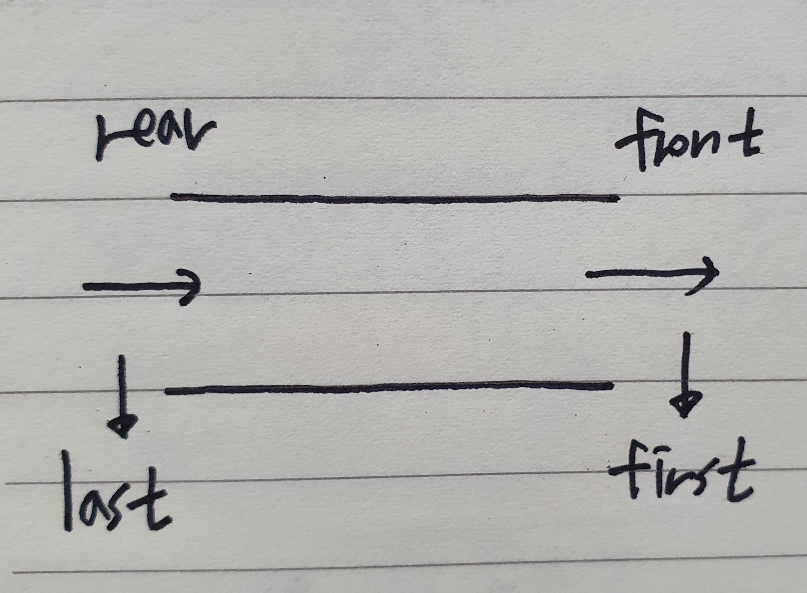

## Comparable, Comparator

## Deque
- 자바에서 덱은 인터페이스로 구현되어 있음
- LinkedList, ArrayDeque 등을 사용할 수 있음

  

- 일반적으로 아래와 같은 3가지 타입의 메서드를 주로 사용함
~~~
Deque<Integer> deque = new LinkedList<>();

deque.add(1);
deque.addLast(1);
deque.addFirst(1);

deque.poll();
deque.pollLast();
deque.pollFirst();

deque.peek();
deque.peekLast();
deque.peekFirst();
~~~

- 아래 그림과 메서드를 매칭시키면 됨

  
