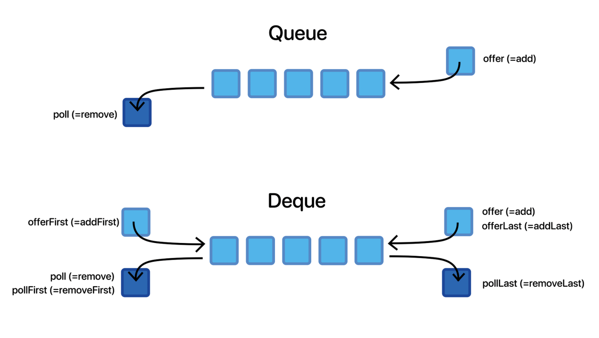

# Queue
 
- ## __Deque__
1. 양방향으로 넣고 뺄 수 있는 스택과 큐를 조합한 자료구조
2. LinkedList, ArrayDeque 등을 사용할 수 있음
3. 일반적으로 아래와 같은 3가지 메서드를 많이 사용함
~~~java
Deque<Integer> deque = new LinkedList<>();

deque.add(1);
deque.addLast(1);
deque.addFirst(1);

deque.poll();
deque.pollLast();
deque.pollFirst();

deque.peek();
deque.peekLast();
deque.peekFirst();
~~~

- ## __Priority Queue__
1. 우선순위가 높은 데이터가 먼저 나오는 큐 자료구조
2. 아래의 Pair 클래스를 낮은 행 우선으로, 행이 같을 경우 낮은 열 우선으로 정렬하려면 Comparator 를 활용하여 compare 메서드를 구현해야함
~~~java
static class Pair {
    int r, c;
    public Pair(int r, int c) {
        this.r = r;
        this.c = c;
    }
}

PriorityQueue<Pair> q = new PriorityQueue<>(new Comparator<Pair>(){
    @Override
    public int compare(Pair p1, Pair p2) {
        if (p1.r != p2.r) {
            return p1.r - p2.r;
        } else {
            return p1.c - p2.c;
        }
    }
});
~~~

# Map
- ## TreeMap
1. 키를 자동으로 정렬해줌
~~~java
Map<Integer, Character> map = new TreeMap<>();
for (int i = 4; i >= 0; i--) {
    map.put(i, (char)('a' + i));
}
for (Integer key : map.keySet()) {
    System.out.println(key + " : " + map.get(key));
}

/*
0 : a
1 : b
2 : c
3 : d
4 : e
*/
~~~

# Comparable, Comparator

# Heap
